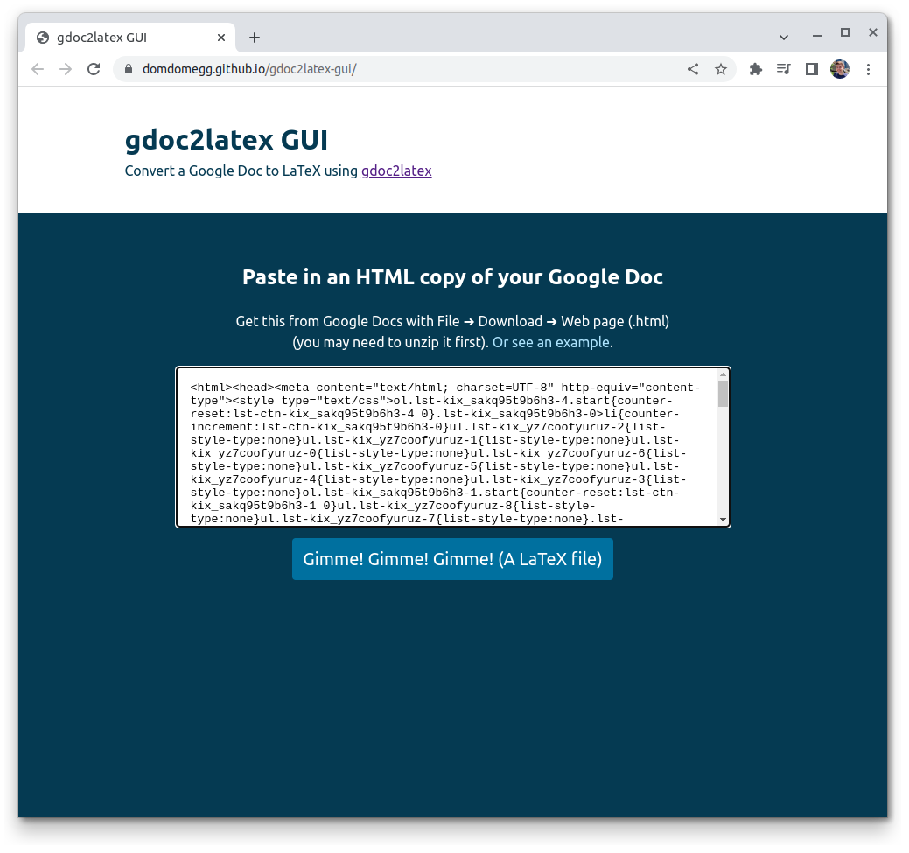
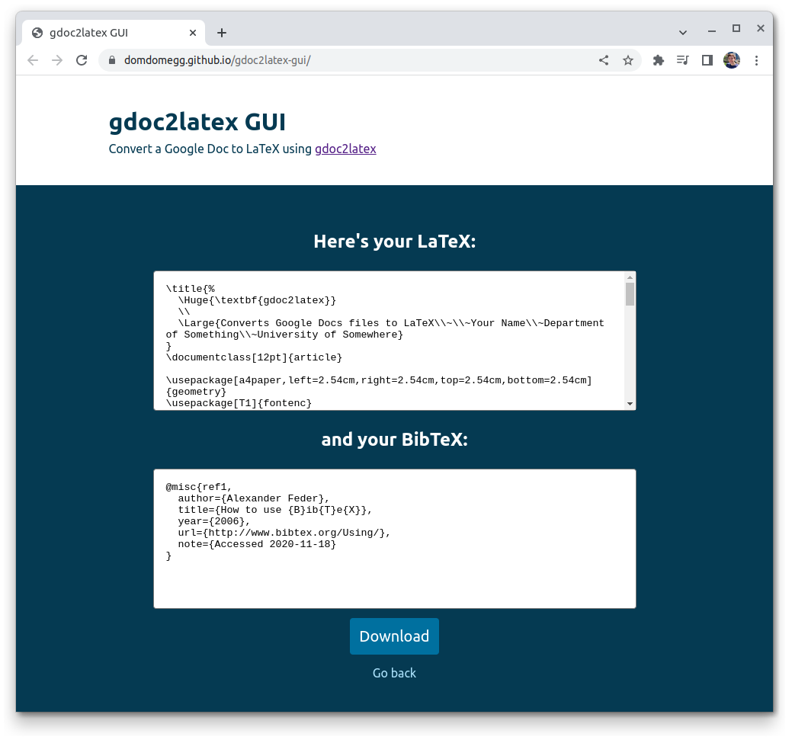

# gdoc2latex-gui [(view live)](https://domdomegg.github.io/gdoc2latex-gui/)

Web interface for [gdoc2latex](https://github.com/domdomegg/gdoc2latex).

Simply paste in your Google Doc in HTML format, hit convert and get a (somewhat reasonable) LaTeX source out.

| Input page | Results page |
| - | - |
|  |  |

## 🙌 Contributing

Contributions are welcome! To get started, install Node and NPM, setup the app and run it.

### Setup

```
npm install
```

### Run

```
npm start
```

### Build

```
npm run build
```

### Test

```
npm run test
```
